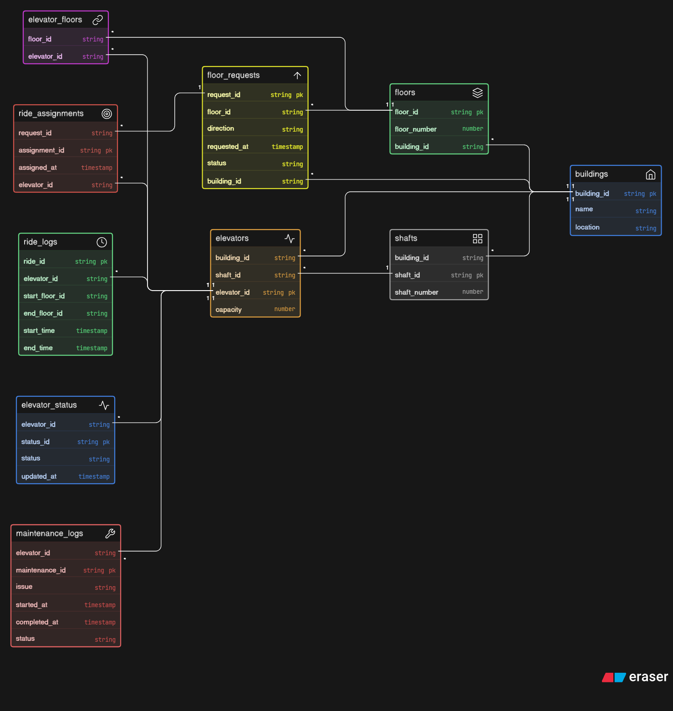

# Smart Elevator Control System – ER Diagram

## 📌 Overview

This project presents the ER diagram for a smart elevator control system used in large buildings such as corporate towers, malls, and airports.

The system is designed to manage multiple buildings, elevators, floor requests, ride assignments, maintenance tracking, and usage logs efficiently.

---

## Core Entities

* **Building** → Represents physical buildings
* **Floor** → Floors within a building
* **Elevator** → Elevators operating in buildings
* **ElevatorShaft** → Physical shaft containing elevator
* **ElevatorFloor** → Mapping between elevators and floors
* **FloorRequest** → Requests generated by users
* **RideAssignment** → Assignment of requests to elevators
* **RideLog** → Records completed rides
* **ElevatorStatus** → Tracks current status of elevators
* **MaintenanceLog** → Stores maintenance history

---

## Relationships

* One building contains many floors and elevators
* Elevators can serve multiple floors
* Floors can be served by multiple elevators
* Users generate floor requests from floors
* Each request is assigned to one elevator
* Elevators complete multiple rides over time
* Maintenance logs are recorded per elevator

---

## ER Diagram

---

## Files

* `erd.png` → ER Diagram
* `README.md` → Documentation
